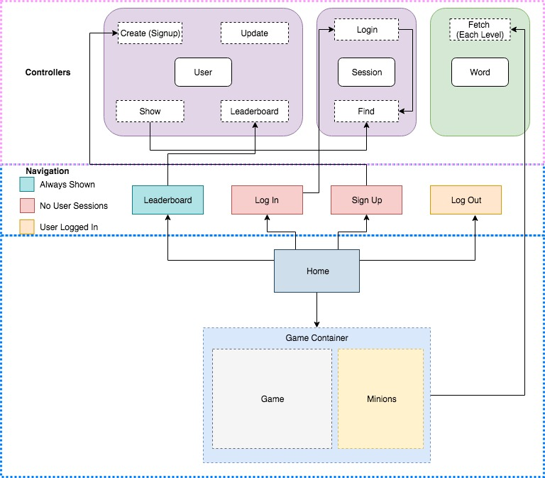

# Minion /REACH/
**BELLOOO!!** I mean.. Hello! Welcome to Minion Reach, a ~~word guessing game~~ challenging mission in which you are asked to deciper the codes set up by minions in order to save a banana farm from being consumed wholly by minions. Each mistake allows a minion to sneakily enter the farm, and the mission will be over when 6 minions are able to enter. It won't be easy! The minions have a very extensive vocabulary. Are you up for the challenge? :bowtie:

_This is a word guessing game created with React.js and Ruby on Rails and has been tested on a Google Chrome browser. This game is experienced best at or above a width of 1000px._

## Demo

[Minion Reach Demo](https://minion-reach.herokuapp.com/)

## Features
* 4 Levels of Difficulty (Easy, Normal, Hard, Bananas)
* Leaderboard Displaying Top 10 Players (Only users who are logged in will be able to save scores)
    * Scores are awarded based on level completed
        * Easy &rarr; +10 points
        * Normal &rarr; +30 points
        * Hard &rarr; +50 points
        * Bananas &rarr; +100 points
* User Input Via On-Screen Keyboard or User Keyboard (Window focus must be inside game container)

## Getting Started
#### Compressed File Containing Both Client & Server Directory:
Please cd into the client directory and server directory in two different terminals and follow directions below to run locally.

#### Cloning from GitHub
Please clone both client and server repositories.

The client repository can be found at: [Minion Reach Client](https://github.com/hyoyou/minion-reach-client)

The server repository can be found at: [Minion Reach Server](https://github.com/hyoyou/minion-reach-api)

After cloning the repo, please cd into each directory and follow the directions below to run locally.

#### Playing Locally
In the client directory, please run `npm install && npm start` to start the server. In a browser, navigate to `http://localhost:3000/` to begin. (Note: you may be using a different port number. Please update accordingly)

In the server directory, run `bundle install` to install dependencies. Run `rake db:create` to create the database, then `rake db:migrate` to migrate local database. To start the application on your machine, run `rails s -p 3001` (Note: you may be using a different port number. Please update accordingly).

When the server successfully runs, you should be able to ~play the game~ begin your mission at `http://localhost:3000/`. The default level of difficulty is set to 'normal'. 

## Implementation
#### Client Side
The front-end design has been implemented using React.js along with Redux to manage application state. With React, I can easily render a number of components and automatically update state changes seamlessly as a single-page application. The React state managed in the Game Container component consisted of..
* gameState, which is an array holding the current state of the game (after fetching the secret word, which is saved in application state, the gameState is an array holding underscores '_' of the hidden letters of the secret word)
* wrongGuesses, which is an array holding the letters that the user guessed which are not part of the secret word
* lives, which starts out at 6 and decrements with each wrong guess
* toggle, which is a boolean value that shows or hides the end of game modal
* win, which is a boolean value indicates if the game is over or not

The user is given an option to choose a difficulty on the home page, which is saved to application state so that the level chosen will be remembered thoughout the game even when the user navigates back and forth to other pages. When the "Start Game" button is pressed, they are directed to the game play page and a fetch request is made to the server upon page load, which requests the word list for the chosen difficulty from an external dictionary API and sends it back to the client. This word is saved in our application state, which is then accessed by component state to update its values. Further gameplay only updates the component state until the game is over and a logged in user has won, in which case an action will be dispatched so that the user's data is updated with the score. 

#### Server Side

The back-end of this application is set up using Ruby on Rails. I had initially planned to implement a server to manage users, but also ended up making calls to the external API from the server due to CORS issues from trying to fetch from the front-end. I have never tried this set up before of making a controller whose purpose is to only make calls to another API, so I had to give it some thought and try planning it out, as shown in the diagram above. I feel like making a call to the API from the server to pass on back to the client feels like an extra step, and I would love to find out how to implement this better in later versions of this application.

The user authentication between the Rails server and React client is completed using JSON Web Token(JWT). Upon successful creation (sign up) of a user, the server sends back a token to the client, and this token must be included in the header for future communications with the server regarding any action that needs authentication.

## Contributing
Bug reports and pull requests are welcome on GitHub at https://github.com/hyoyou/minion-reach-client. This project is intended to be a safe, welcoming space for collaboration, and contributors are expected to adhere to the [Contributor Covenant](http://contributor-covenant.org) code of conduct.

## License
The project is available as open source under the terms of the [MIT License](https://github.com/hyoyou/minion-reach-client/blob/master/LICENSE).